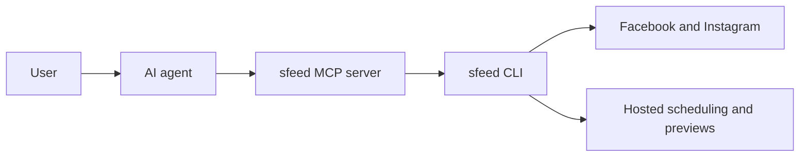

# sfeed

Post to Facebook Pages and Instagram from the terminal or through MCP.

sfeed is a CLI for people who want to automate social posting, and an MCP server for agents that need to do the same work safely.

Most of the product lives at [sfeed.dev](https://sfeed.dev).

- Docs: [sfeed.dev/docs](https://sfeed.dev/docs)
- Install: [sfeed.dev/install.sh](https://sfeed.dev/install.sh)
- Pricing: [sfeed.dev/pricing](https://sfeed.dev/pricing)

## What it does

- Connect Facebook Pages and linked Instagram accounts with one browser auth flow
- Post now from the terminal
- Schedule posts for later, even when your laptop is closed
- Open browser previews for scheduled posts
- Expose MCP tools so agents can inspect status, schedule work, and manage the queue

## Agent-first workflow

sfeed is built to be driven by an agent.

Run `sfeed mcp`, connect it to Claude, Codex, OpenCode, or any MCP client, and the agent can:

- check connected accounts
- inspect page choices
- create immediate posts
- schedule posts
- open the hosted queue UI
- open a hosted preview for one scheduled post
- reschedule, duplicate, or cancel queued jobs



## Install

Use the install script:

```bash
curl -fsSL https://sfeed.dev/install.sh | sh
```

Or install from npm:

```bash
npm install -g @sfeed/cli
```

Requires Node.js 20+.

## Quick start

```bash
sfeed auth facebook
sfeed mcp
```

That connects your accounts and starts the MCP server.

## CLI examples

```bash
sfeed post "shipping today" --to facebook
sfeed post "launch image" --to instagram --media ./launch.jpg
sfeed post "tomorrow at 9" --to facebook --at "2026-04-10T13:00:00Z"

sfeed schedule status
sfeed schedule open
sfeed schedule preview <id>
sfeed schedule reschedule <id> --at "2026-04-11T13:00:00Z"
sfeed schedule duplicate <id>
sfeed schedule cancel <id>
```

## MCP example

Claude Desktop config:

```json
{
  "mcpServers": {
    "sfeed": {
      "command": "sfeed",
      "args": ["mcp"]
    }
  }
}
```

Once connected, the agent can inspect status, choose the right Page, post immediately, schedule posts, and manage the queue.

Full MCP docs: [sfeed.dev/docs/mcp](https://sfeed.dev/docs/mcp)

## Current platforms

- Facebook Pages
- Instagram Business or Creator accounts linked to a Facebook Page

## Links

- Main site: [sfeed.dev](https://sfeed.dev)
- Docs: [sfeed.dev/docs](https://sfeed.dev/docs)
- MCP docs: [sfeed.dev/docs/mcp](https://sfeed.dev/docs/mcp)
- Scheduling docs: [sfeed.dev/docs/scheduling](https://sfeed.dev/docs/scheduling)
- Pricing: [sfeed.dev/pricing](https://sfeed.dev/pricing)
